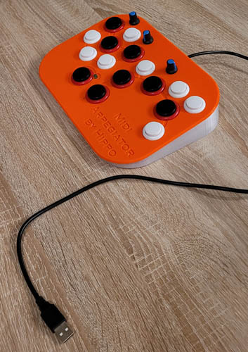
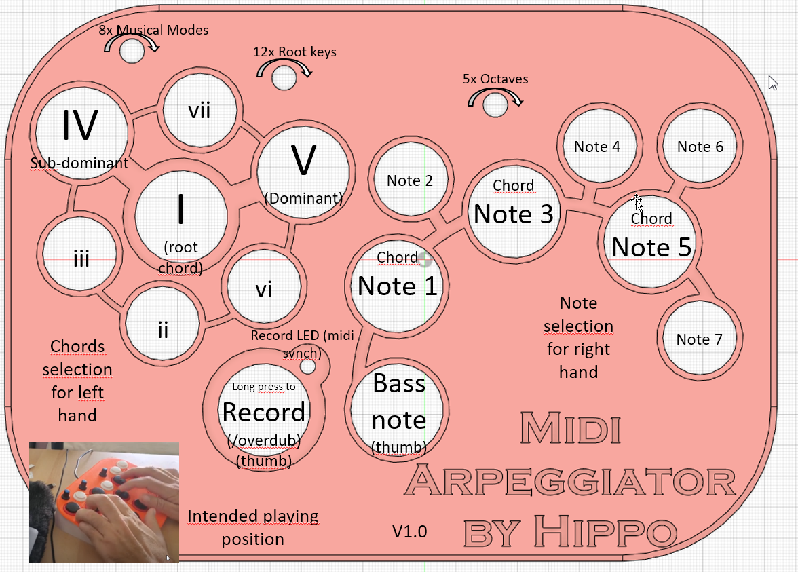

# Midi-Arpeggiator

Hello to everyone, My name is Hippolyte Mounier, I'm learning Arduino and electronics.
I share this fun project that makes me very creative musically. 
It can be used as arpeggiator and as composition tool.
Problem solving : It helps me  express out ideas quickly as I'm not a professional composer and can't really play the piano that well.
This device is meant to be used with desktop softwares called Digital Audio Workstation (DAWs) like Ableton Live, FL studio, Reason and the like.
It is plug-n-play and connects with a USB cable to the desktop computer. (But it has not enough power to be recognised by my Ipad). I'm surprised that this project turned out acheiving such professional level of usability and robustness so soon (1 week). Good job little arduino micro!

Demo here on Youtube https://www.youtube.com/watch?v=DeB5YvRfC6c

Photo of the Full Assembly:

Full schematic of the main panel: May look complex at first :-) but it's fool proof. My 10 years old daughter can play it! In theory you should use the big buttons more often than the small ones.

+ USB midi controler
+ The design is by me. 
+ No reference to existing devices. 
+ Inspiration from software midi VST like Instachord, Melodicflow, Nora, Chtullu or Captain Chord.
+ 3D Made with Fusion 360 in 3h. (see files enclosed)
+ The body is 3D printed in PETG plastic, in 2 pieces : orange face (6h printing time) and translucent walls (3h printing time) glued together. A plug on the back secures the usb cable. (30 min printing time, in 2 parts)
+ Buttons are low cost arcade machine buttons from another project

7 buttons on left hand are presets for the chords I, II, III, IV, V, VI and VII of the mode and the root key (choosen via potentiometer below)
+  Pressing a chord button twice inverts the chord (minor gets major and major gets minor)
+  Pressing a chord 3 times pushes all notes +1 semitone, to reach out-of-harmony chords and accidentals

8 buttons for individual notes 1-7 in a key, similar to a piano white keys for C major
  + Inclusive a bass note for the right thumb, 1 octave down

A single record button. Performing :
  1. record (press continuously, it plays a loop immediately after button release), 
  2. play (short press), 
  3. overdub (press continuously while playing) 
  4. and stop (short press) 

3x potentiometers for (8x)Mode, (12x)Root Keys and (5x)Octave

8x Music modes I choose are 
  1. Major
  2. Minor harmonic
  3. Minor melodic
  4. Minor natural (eolian)
  5. Dorian (celtic)
  6. Mixolydian (folk blues)
  7. Phrygian (metal)
  8. Phrygian Dominant (metal)

12x Root Keys I choose are 
+    in order of fiths starting with C, then G, D, A, E, B, F#, ...
+  Goal: being in fifths you can apply most useful tonal changes easily    

5x Octaves I choose are 
    -2, -1, 0, +1, +2

+ Recording led : green
+ The "brain" of the system is an Arduino micro, using midiusb library
+ Coding in C++ by me
+ I used a prototype board and soldered only some basic resistors and the wires.
+ Midi synchronisation as slave. 
+ Midi Velocity is fixed value (100) only
+ Midi Chanel 1 only
+ Latency is in my opinion negligible. At least on my Focusrite scarlett solo ASIO sound card. Some Latency can be seen on midi note editor.

It took me roughly about 12 h to build the prototype from start to finish. (I'm learning !)

Arduino pins:
+ pin A0 connects to mode pot
+ pin A1 connects to Root pot
+ pin A2 connects to octave pot
+ pin A3 connects to chord buttons voltage read with Resistors in parallel for each button to differentiate voltages + 1 single 1K resitor in serie + 1 x 0.22uF capacitor in parallel for smooting the values, optional
+  button for chord I is connected directly with no resistor
+  button for chord II is in serie with 100 Ohm resistor
+  button for chord III is in serie with 320 Ohm resistor
+  button for chord IV is in serie with 560 Ohm resistor
+  button for chord V is in serie with 1K Ohm resistor
+  button for chord VI is in serie with 2.2K Ohm resistor
+  button for chord VII is in serie with 10K Ohm resistor

All note buttons are connected to GND

all pots connected to pin AREF and GND
+ pin 2 is connected to button note 1 
+ pin 3 is connected to button note 2
+ pin 4 is connected to button note 3
+ pin 5 is connected to button note 4
+ pin 6 is connected to button note 5
+ pin 7 is connected to button note 6
+ pin 8 is connected to button note 7
+ pin 10 is connected to LED in serie with resistor (probably 1K)
+ pin 11 is connected to button "bass" note
+ pin 12 in connected to record button

Dimensions: roughly 250 x 185 x 65

Parts required:
+ Arduino Micro
+ 1m USB cable that connects USB A to USB micro
+ 8 large arcade buttons
+ 8 small arcade buttons
+ wire
+ 0.22 uF capacitor
+ 6x resistors R = 100, 320, 560, 1K, 2.2K and 10K
+ 1x resistor for the led R= 1K
+ PETG filament for 3D printer (PLA should do fine too)
+ 3D printer with heated bed and large >=250 cm print area
+ super glue, to bond the plate and the side wall
+ prototype board 70x90
+ 2x M3 screws
+ 3 potentiometers 10K
+ soldering iron

Hoping you'll like it. Please leave a comment on what you think or believe should be improved.
https://www.reddit.com/r/ArduinoProjects/comments/171mva3/new_arduino_based_midi_arpeggiator_3d_printed/

3D models STL files are also on Thingiverse : 
https://www.thingiverse.com/thing:6257589

License: CC BY-NC, see https://creativecommons.org/licenses/by-nc/4.0/
This license enables reusers to distribute, remix, adapt, and build upon the material in any medium or format for noncommercial purposes only, and only so long as attribution is given to the creator. CC BY-NC includes the following elements:

 BY: credit must be given to the creator.
 NC: Only noncommercial uses of the work are permitted.

Hippolyte
